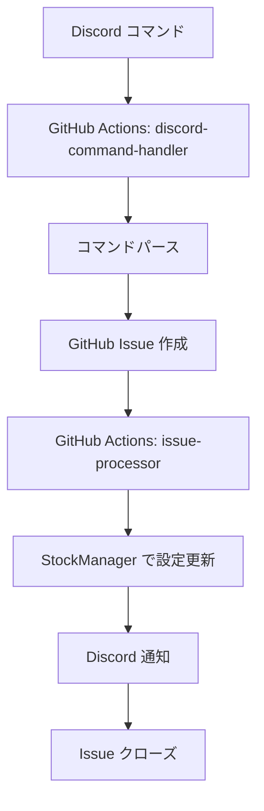

# Discord 株式管理コマンド

GitHub Issues経由でDiscordから株式の監視リストを管理できるシステムです。

## 使用方法

### 1. 基本的な流れ

1. **Discord**で管理コマンドを送信
2. **GitHub Actions**でコマンドを処理してIssueを作成
3. **GitHub Actions**でIssueを処理して設定を更新
4. **Discord**に結果を通知

### 2. 対応コマンド

#### 📈 株式追加
```
!add-stock シンボル [名前] [市場]
```

**例:**
```
!add-stock AAPL Apple us
!add-stock 369A.T エータイ jp
!add-stock 369A.T エータイ        # 市場指定なし → 日本株
!add-stock BTC-USD Bitcoin crypto
!add-stock TSLA.L Tesla eu
!add-stock 700.HK Tencent asia
!add-stock SHOP.TO Shopify ca
!add-stock BHP.AX BHP au
```

**市場の指定:**
- `jp`: 日本株（デフォルト）
- `us`: 米国株  
- `crypto`: 暗号通貨
- `eu`: 欧州株
- `asia`: アジア株（日本以外）
- `ca`: カナダ株
- `au`: オーストラリア株

**市場指定なしの場合:**
市場を指定しない場合、デフォルトで日本株 (`jp`) として処理されます。

#### 📉 株式削除
```
!remove-stock シンボル
```

**例:**
```
!remove-stock AAPL
!remove-stock 369A.T
```

#### 📊 銘柄一覧表示
```
!list-stocks
```

現在の監視銘柄を市場別に表示します。

#### 🗑️ 全銘柄削除
```
!clear-stocks
```

⚠️ **注意**: 全ての監視銘柄を削除します。

### 3. 実行方法（完全サーバー不要）

#### 方法1: GitHub Actions手動実行（推奨）
1. GitHubリポジトリの「Actions」タブに移動
2. 「Discord Command Handler」ワークフローを選択
3. 「Run workflow」をクリック
4. `discord_message`にコマンドを入力
5. `discord_username`にユーザー名を入力（オプション）
6. 「Run workflow」で実行

#### 方法2: GitHub Issues直接作成
1. GitHubリポジトリで新しいIssueを作成
2. 指定フォーマットでタイトルと内容を入力
3. Labels: `discord-command`, `action-add` を追加
4. 「Submit」でIssueを作成

**サーバー契約不要で完全無料運用が可能！**

### 4. 設定

#### 必要な環境変数
- `DISCORD_WEBHOOK_URL`: Discord Webhook URL（通知用）
- `GITHUB_TOKEN`: GitHub Personal Access Token（自動設定）

#### 設定ファイル
株式データは `data/stocks.json` に保存されます:

```json
{
  "stocks": [
    {
      "symbol": "AAPL",
      "name": "Apple",
      "market": "us"
    },
    {
      "symbol": "369A.T",
      "name": "(株)エータイ",
      "market": "jp"
    }
  ]
}
```

### 5. 処理フロー



### 6. エラーハンドリング

#### 無効なコマンド
無効なコマンドの場合、Discord に有効なコマンド一覧が表示されます。

#### 重複する銘柄
既に存在する銘柄を追加しようとした場合、エラーメッセージが表示されます。

#### 存在しない銘柄
存在しない銘柄を削除しようとした場合、エラーメッセージが表示されます。

### 7. 制限事項

- 市場の手動指定は必須ではありませんが、推奨します
- シンボルは大文字で統一されます
- 同じシンボルは重複して登録できません

### 8. トラブルシューティング

#### Discord通知が届かない
- `DISCORD_WEBHOOK_URL` が正しく設定されているか確認
- WebhookのURLが有効か確認

#### GitHub Actions が実行されない
- リポジトリの権限設定を確認
- `GITHUB_TOKEN` の権限を確認

#### 株式が追加されない
- JSON ファイルの形式が正しいか確認
- ファイルの書き込み権限を確認

## 開発者向け情報

### ファイル構成
- `utils/discord_commands.py`: コマンドパーサー
- `utils/stock_manager.py`: 株式管理ロジック
- `data/stocks.json`: 株式データ
- `.github/workflows/discord-command-handler.yml`: コマンド処理ワークフロー
- `.github/workflows/issue-processor.yml`: Issue処理ワークフロー

### 拡張方法
新しいコマンドを追加する場合:
1. `discord_commands.py` にパターンを追加
2. `issue-processor.yml` に処理ロジックを追加
3. `stock_manager.py` に必要な機能を追加