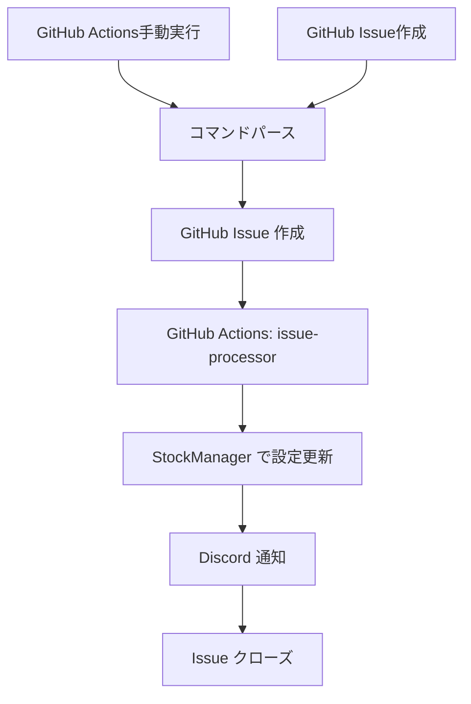

# 株式管理システム利用ガイド

**完全サーバー不要**で株式の監視リストを管理できるシステムです。

## 🚀 利用方法（サーバー不要）

### 方法1: GitHub Actions手動実行（推奨）

1. **GitHubリポジトリ**にアクセス
2. **Actions**タブに移動
3. **Discord Command Handler**ワークフローを選択
4. **Run workflow**をクリック
5. コマンドを入力して実行

#### 実行例
```
discord_message: !add-stock AAPL Apple us
discord_username: your_username
```

### 方法2: GitHub Issues直接作成

1. **GitHubリポジトリ**で新しいIssueを作成
2. **タイトル**と**内容**を指定フォーマットで入力
3. **Labels**に `discord-command`, `action-add` を追加
4. **Submit**でIssueを作成

#### Issue作成例
```
タイトル: Add Stock: AAPL (Apple)

内容:
## 株式追加リクエスト

**シンボル**: AAPL
**名前**: Apple
**市場**: us
**リクエスト者**: your_username
```

## 📋 対応コマンド

### 株式追加
```
!add-stock AAPL Apple us
!add-stock 369A.T エータイ jp
!add-stock 369A.T エータイ        # 市場指定なし → 日本株
!add-stock BTC-USD Bitcoin crypto
```

### 株式削除
```
!remove-stock AAPL
!remove-stock 369A.T
```

### 銘柄一覧表示
```
!list-stocks
```

### 全銘柄削除
```
!clear-stocks
```

## 🌍 対応市場

- **jp**: 日本株（デフォルト）
- **us**: 米国株
- **crypto**: 暗号通貨
- **eu**: 欧州株
- **asia**: アジア株（日本以外）
- **ca**: カナダ株
- **au**: オーストラリア株

## 🔧 Discord通知設定

### 1. Discord Webhookの設定

1. **Discord サーバー設定**
   - チャンネル設定 → 連携サービス → Webhooks
   - **新しいWebhook**を作成
   - Webhook URLをコピー

2. **GitHub Secrets設定**
   - リポジトリ Settings → Secrets and variables → Actions
   - **New repository secret**
   - Name: `DISCORD_WEBHOOK_URL`
   - Value: Discord Webhook URL

### 2. 通知例

```
✅ 処理完了
株式 AAPL (Apple) を監視リストに追加しました

実行コマンド
`add`
```

## 📊 データ管理

### 株式データファイル
```json
{
  "stocks": [
    {
      "symbol": "AAPL",
      "name": "Apple",
      "market": "us"
    },
    {
      "symbol": "369A.T",
      "name": "(株)エータイ",
      "market": "jp"
    }
  ]
}
```

### 設定ファイル
- `data/stocks.json`: 株式データ
- `utils/config.py`: 設定読み込み
- `utils/stock_manager.py`: 株式管理ロジック

## 🔄 処理フロー



## 💰 コスト

- **GitHub Actions**: 月2,000分無料
- **GitHub Issues**: 無制限無料
- **Discord Webhook**: 完全無料
- **株価API**: Yahoo Finance（無料）

**完全無料で運用可能！**

## 🔒 セキュリティ

- **GitHub Token**: 自動設定（権限: actions:write）
- **Discord Webhook URL**: GitHub Secretsで管理
- **環境変数**: GitHub Actions内で処理

## 🐛 トラブルシューティング

### GitHub Actions が実行されない
- ワークフローファイルの存在を確認
- GITHUB_TOKEN の権限を確認

### Discord通知が届かない
- DISCORD_WEBHOOK_URL が正しく設定されているか確認
- WebhookのURLが有効か確認

### 株式が追加されない
- JSON ファイルの形式を確認
- Issueのフォーマットを確認

## 🎯 利点

✅ **サーバー不要** - 完全にGitHub上で動作  
✅ **無料運用** - 全て無料サービスで構築  
✅ **簡単操作** - WebブラウザだけでOK  
✅ **安全** - GitHubの高セキュリティ環境  
✅ **履歴管理** - 全ての操作がGitHubに記録  

## 📈 使用例

1. **手動実行**で `!add-stock AAPL Apple us` を実行
2. **GitHub Actions**で処理開始
3. **Discord**に「株式 AAPL (Apple) を監視リストに追加しました」と通知
4. **定期実行**で株価をDiscordに通知

**完全にサーバー不要で株式管理が可能！**